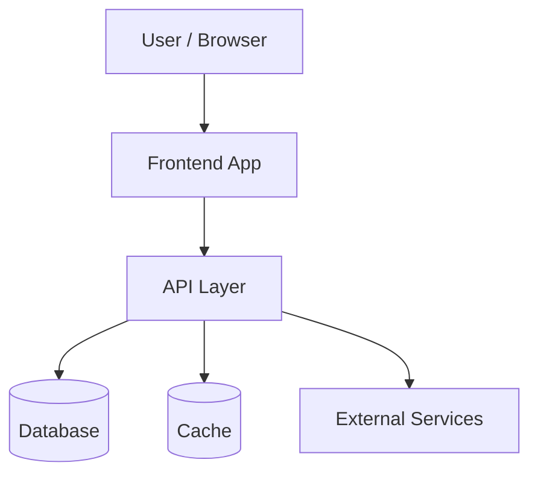
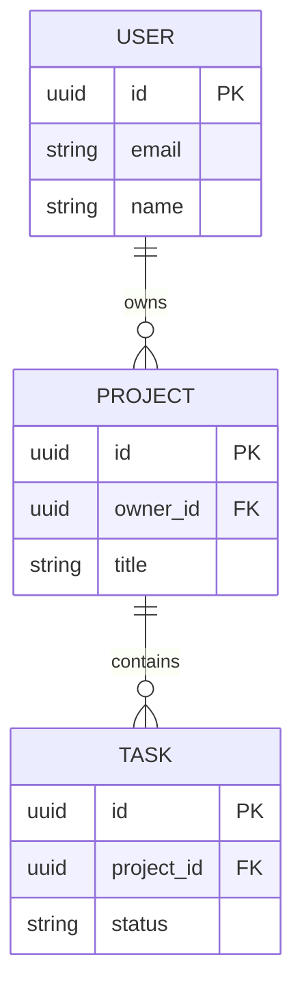

# Architecture

> High-level shape of the system: how requests flow, what the data looks like,
> where code lives, and how data moves. Replace the example diagrams with the real ones.

## System diagram

> Edit this Mermaid graph to reflect actual components.



## Data model

> Entities and their relationships. Edit this Mermaid erDiagram to match the schema.



## Folder structure

> A tree of the meaningful directories. Annotate what each is for.

```text
.
├── src/
│   ├── app/            # routes / pages
│   ├── components/     # UI components
│   ├── lib/            # shared utilities, clients
│   ├── server/         # API handlers, business logic
│   └── db/             # schema, migrations
├── specs/              # SDD feature specs
├── public/             # static assets
└── tests/              # test suites
```

## Data flow

`<Describe a representative request end-to-end: e.g. user submits form →
client validates with zod → POST to API → handler authorizes → writes to DB →
returns result → UI updates via query invalidation. Note where caching,
background jobs, or external calls occur.>`
